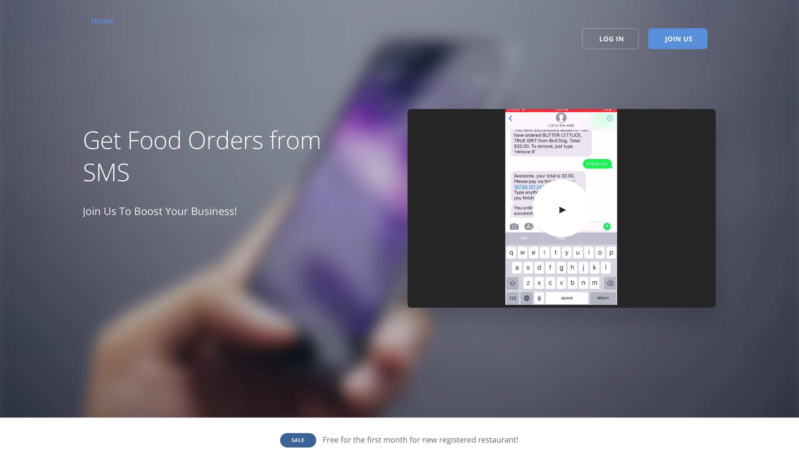

<h1 align="center"><b>Text To Order</b></h1>

<i>Django, Python, PostgreSQL, Twilio, Ngnix, Gunicorn, DigitalOcean</i>

# Introduction
### [Live Demo](http://www.mygoodcanteen.com)

A SMS app for food ordering and a website for restaurant owners to manage their menus and restaurant information.

- Incorporated Twilio API to develop SMS conversation, Stripe API to proceed payment of customer orders. 
- Developed website using Django and configured Memcached for session storage .

    
   
   
      
      

## Tech Stack
Django, Python, PostgreSQL, Twilio, Ngnix, Gunicorn, DigitalOcean, Stripe Elements

      

